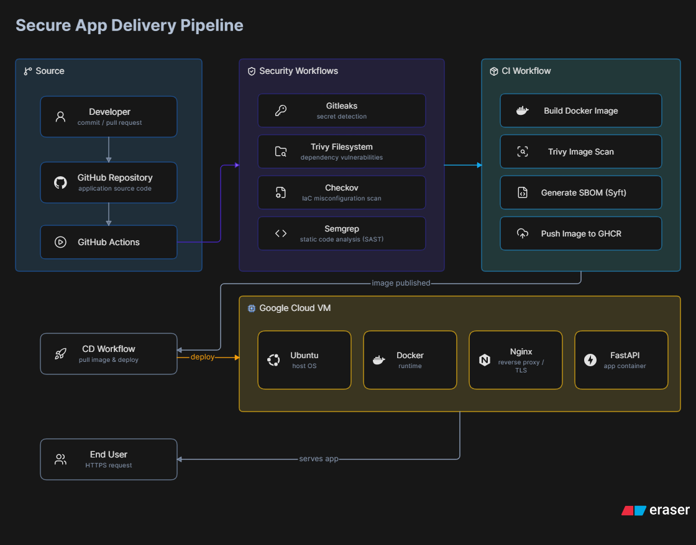

# 🚀 Secure App Delivery Pipeline

A production-inspired Secure Software Delivery Pipeline demonstrating modern DevSecOps practices from source code to deployment.

---

## 📊 Workflow Status

| Workflow | Status |
|----------|--------|
| CI - Build & Publish | [](https://github.com/marshal98/Secure-App-Delivery-Pipeline/actions/workflows/ci.yaml) |
| CD - Deploy | [](https://github.com/marshal98/Secure-App-Delivery-Pipeline/actions/workflows/cd.yaml) |
| Secret Scan | [](https://github.com/marshal98/Secure-App-Delivery-Pipeline/actions/workflows/secret_scan.yaml) |
| SCA (Trivy FS) | [](https://github.com/marshal98/Secure-App-Delivery-Pipeline/actions/workflows/sca.yaml) |
| IaC Security | [](https://github.com/marshal98/Secure-App-Delivery-Pipeline/actions/workflows/iac.yaml) |
| SAST (Semgrep) | [](https://github.com/marshal98/Secure-App-Delivery-Pipeline/actions/workflows/sast.yaml) |

## 🛠️ Tech Stack


---

## 📖 Overview

This project demonstrates how security can be integrated throughout the Software Development Lifecycle (SDLC) using GitHub Actions, Terraform, Docker, Google Cloud Platform (GCP), and multiple security scanning tools.

The objective is to ensure applications are continuously validated for security before reaching production.

---

## 🏗 Architecture

<p align="center">
  
</p>

---

## ✨ Features

- Infrastructure Provisioning with Terraform
- FastAPI Application
- Docker Containerization
- GitHub Actions CI/CD
- Deployment to Google Cloud Platform
- Reverse Proxy using Nginx
- Health Check Validation

### Security Controls

- Pre-Commit Secret Scanning (Gitleaks)
- Secret Scanning Pipeline
- Software Composition Analysis (Trivy Filesystem)
- Infrastructure as Code Security (Checkov)
- Static Application Security Testing (Semgrep)
- Container Image Scanning (Trivy)
- SBOM Generation (Syft)
- Automated Dependency Updates (Dependabot)

---

## 🔒 Security Pipeline

```text
Developer
      │
      ▼
Pre-Commit (Gitleaks)
      │
      ▼
GitHub Push
      │
      ├── Secret Scan
      ├── SCA
      ├── IaC
      ├── SAST
      └── CI
            ├── Build Docker Image
            ├── Container Scan
            ├── Generate SBOM
            ├── Push to GHCR
            └── Deploy
```

---

## 🛡 Security Controls

| Layer | Tool | Purpose |
|---------|------|----------|
| Secret Scanning | Gitleaks | Detect hardcoded secrets |
| Dependency Scanning | Trivy FS | Detect vulnerable dependencies |
| Infrastructure Security | Checkov | Terraform Security Validation |
| Static Code Analysis | Semgrep | Secure Coding Validation |
| Container Security | Trivy Image | Container Vulnerability Scanning |
| Software Supply Chain | Syft | SBOM Generation |
| Dependency Management | Dependabot | Automated Dependency Updates |

---

## ⚙ Technology Stack

### Cloud
- Google Cloud Platform (GCP)

### Infrastructure
- Terraform

### Application
- FastAPI
- Python

### Container
- Docker
- Nginx

### CI/CD
- GitHub Actions

### Security
- Gitleaks
- Trivy
- Checkov
- Semgrep
- Syft
- Dependabot

---

## 📂 Repository Structure

```text
.
├── app/
├── infrastructure/
│   └── terraform/
├── scripts/
├── docs/
├── .github/
│   ├── workflows/
│   └── dependabot.yaml
├── README.md
└── LICENSE
```

---

## 🚀 Future Enhancements

- Cosign Image Signing
- SLSA Provenance
- OWASP ZAP
- Kubernetes Deployment
- GitOps (ArgoCD)
- Runtime Security (Falco)
- OPA Policy Enforcement

---

## 📚 Lessons Learned

This project demonstrates how security can be integrated throughout the software delivery lifecycle using a shift-left approach.

Key takeaways include:

- Security should be automated.
- Every security control should have a single responsibility.
- Infrastructure should be validated before deployment.
- Containers should be scanned before publication.
- SBOMs improve software supply chain visibility.
- Dependency updates should be automated.

---

## 📄 License

This project is licensed under the MIT License.