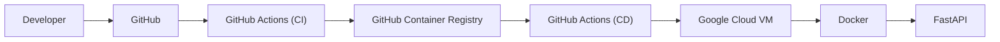

# 🚀 Secure App Delivery Pipeline


## Overview

Secure App Delivery Pipeline is an end-to-end DevSecOps project demonstrating how modern applications can be securely built, containerized, published, and deployed to Google Cloud using Infrastructure as Code and GitHub Actions.

The project focuses on automation, repeatability, and secure deployment practices while remaining simple enough to understand and extend.

---

## Features

- Infrastructure as Code using Terraform
- Google Cloud VPC, Subnet and Firewall
- Compute Engine VM
- Dockerized FastAPI application
- GitHub Container Registry (GHCR)
- GitHub Actions Continuous Integration
- GitHub Actions Continuous Deployment
- Health Check validation
- Nginx Reverse Proxy
- SSH-based automated deployment

---

## Architecture



---

## Repository Structure

```text
.
├── app/
├── infrastructure/
├── docs/
├── .github/
└── README.md
```

---

## Documentation

| Document | Description |
|----------|-------------|
| architecture.md | Solution Architecture |
| infrastructure.md | Terraform Infrastructure |
| application.md | FastAPI Application |
| ci.md | CI Pipeline |
| cd.md | CD Pipeline |
| troubleshooting.md | Common Issues |
| roadmap.md | Future Enhancements |

---

## Tech Stack

- Python
- FastAPI
- Docker
- Terraform
- GitHub Actions
- GitHub Container Registry
- Google Cloud Platform
- Ubuntu
- Nginx

---

## Future Enhancements

- Trivy
- Gitleaks
- Checkov
- SBOM
- HTTPS
- Automatic Rollback
- Blue/Green Deployment.