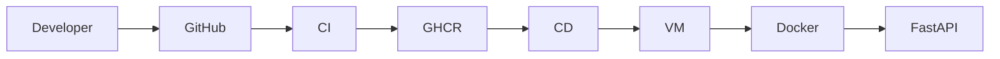

# Architecture

## High Level Architecture

## Components

### Developer

Pushes application changes.

### GitHub

Hosts source code and triggers workflows.

### CI

Builds and publishes Docker images.

### GHCR

Stores versioned container images.

### CD

Deploys application to the VM.

### Google Cloud VM

Runs Docker containers.

### FastAPI

Hosts the Secure Notes API.